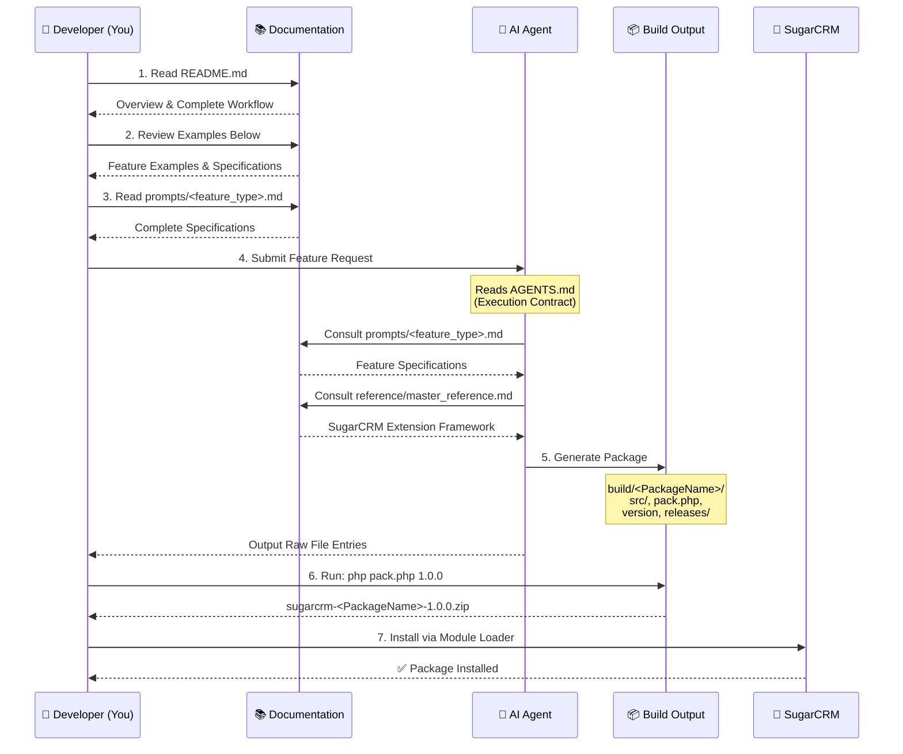

# AI for Sugar Devs 🤖🍬

**AI for Sugar Devs** is a deterministic, agent-agnostic system for generating **installable, upgrade-safe SugarCRM Module Loadable Packages (MLPs)** using AI.

Designed for **Sugar developers**, it automates module generation while enforcing **Extension Framework compliance**, upgrade safety, and deterministic outputs.

---

## 🚀 Quick Start for Humans

**You're reading the right file!** This is the entry point for developers like you.

### Step 1: Understand the Workflow
Review the workflow diagram and examples below to understand the complete process.

### Step 2: Pick Your Feature Type
Choose your feature type from the examples and feature list below.

### Step 3: Read Feature Specifications
Choose your feature type from `/prompts/`:
- **[prompts/logic_hook.md](prompts/logic_hook.md)** — Logic hooks
- **[prompts/custom_field.md](prompts/custom_field.md)** — Simple custom fields
- **[prompts/custom_field_type.md](prompts/custom_field_type.md)** — Complex field types
- **[prompts/relationship.md](prompts/relationship.md)** — Relationships
- **[prompts/rest_endpoint.md](prompts/rest_endpoint.md)** — REST endpoints
- **[prompts/scheduler.md](prompts/scheduler.md)** — Scheduled jobs
- **[prompts/ui_customization.md](prompts/ui_customization.md)** — UI customizations
- **[prompts/pack_php.md](prompts/pack_php.md)** — Pack.php generation
- **[prompts/external_resource_client.md](prompts/external_resource_client.md)** — HTTP requests
- **[prompts/feature_request_format.md](prompts/feature_request_format.md)** — Request format

### Step 4: Format Your Request
Use the format from **[prompts/feature_request_format.md](prompts/feature_request_format.md)** and the examples below.

### Step 5: Prompt the AI
Give the AI agent your formatted feature request. It will generate a complete package.

### Step 6: Test & Install
```bash
cd build/<PackageName>
php pack.php 1.0.0
# Install the zip via Module Loader in Sugar
```

---

## 🔄 Complete Workflow

### Visual Workflow Diagram



### Step-by-Step Workflow

1. You write feature request
2. You read relevant prompt (or quick reference)
3. You prompt AI with your request
4. AI generates package in `build/<PackageName>/`
5. You test with: `php build/<PackageName>/pack.php`
6. You install zip in Sugar via Module Loader

---

## 📚 Real-World Examples

**Need templates to get started?** Check the `examples/` folder for copy/paste feature requests:

- **[examples/01_logic_hook_webhook.md](examples/01_logic_hook_webhook.md)** — Send webhook when account is saved
- **[examples/02_custom_field_varchar.md](examples/02_custom_field_varchar.md)** — Add custom text field
- **[examples/03_relationship_many_to_many.md](examples/03_relationship_many_to_many.md)** — Link modules together
- **[examples/04_rest_endpoint_api.md](examples/04_rest_endpoint_api.md)** — Create REST API endpoint

### Two Ways to Request Features

**Option 1: Use the structured format from examples**
```
Feature Type: Custom Field
Module: Accounts
Field Name: customer_priority
Field Type: varchar
Label: Customer Priority
Package Name: Acme_AccountsPriority
```

**Option 2: Describe in natural language**
> "A custom varchar field named **customer_priority** is added to the Accounts module under the package **Test_AccountsCustomField**, labeled "Customer Priority," and designed as a highlight field that allows users to choose background and foreground colors in Studio."

**Both work equally well!** Use whichever format feels more natural for your request.

**Want to contribute your own?** See `examples/README.md` to add examples for other feature types!

---

## 🔧 Key Points for All Features

- ✅ **Review** the workflow diagram and examples above
- ✅ **Choose** your feature type from the examples
- ✅ **Read** `prompts/<feature_type>.md` for complete specifications
- ✅ **Follow** the format from `prompts/feature_request_format.md`
- ✅ **Prompt** the AI with your formatted request
- ✅ **Test** with `php build/<PackageName>/pack.php`
- ✅ **Install** via Module Loader in Sugar

---

## 📚 Features

* Generate full MLPs: Logic Hooks, Custom Fields, Relationships, REST Endpoints, Scheduler Jobs, UI Customizations
* **Extension Framework only** — no core overrides
* Self-contained per-package builds in `/build/<PackageName>/`
* Production-ready `pack.php` per package
* Deterministic output — raw file entries, upgrade-safe, ready for Module Loader
* Agent-agnostic — works with Claude, Copilot, ChatGPT, Codex, etc.

---

## 📁 Architecture Overview

Each generated feature lives in an isolated directory:

```
/build/<PackageName>/
    src/                      # All Sugar files (Extension Framework only)
    pack.php                  # Executable package builder
    version                   # Version file
    releases/                 # Generated zip output
```

Running the package builder:

```bash
cd build/<PackageName>
php pack.php 1.0.0
```

Produces:

```
build/<PackageName>/releases/sugarcrm-<PackageName>-1.0.0.zip
```

Ready for **Module Loader** installation in Sugar.

---

## 📖 Documentation Structure

```
README.md                     ← YOU ARE HERE (complete guide for humans)
├── AGENTS.md                ← Technical contract (for AI agents, not humans)
└── prompts/
    ├── feature_request_format.md .... How to format your request
    ├── [11 feature-specific specs]
    │   ├── logic_hook.md ........... Logic hook specifications
    │   ├── custom_field.md ......... Simple field specifications
    │   ├── custom_field_type.md .... Complex field type specifications
    │   ├── relationship.md ......... Relationship specifications
    │   ├── rest_endpoint.md ........ REST endpoint specifications
    │   ├── scheduler.md ............ Scheduler specifications
    │   ├── ui_customization.md ..... UI customization specifications
    │   ├── feature_generator.md .... Master generation prompt
    │   ├── pack_php.md ............ Pack.php generation
    │   └── external_resource_client.md  HTTP request handling
└── reference/
    ├── README.md ........................... Reference guide
    ├── master_reference.md ................ Complete SugarCRM specs
    └── sugar_developer_guide_25.2_md/ .... Official SugarCRM documentation
```

---

## ⚙️ For AI Agents (Not for Humans)

**AI agents:** Read **[AGENTS.md](AGENTS.md)** for the binding execution contract.

This document specifies:
- Mandatory directory structure
- Required file formats
- Extension Framework compliance rules
- pack.php specifications
- Output format requirements
- Quality assurance checklist

---

## 🔧 Key Points
* No embedded Sugar Developer Guide content
* Deterministic file output format

---

## 🛠 How to Use

### 1️⃣ Upload Repo to AI Agent

Upload the full repository to your AI coding agent (Claude, Copilot, ChatGPT, Codex, etc.).

---

### 2️⃣ Submit a Feature Request

Use the **structured format** defined in `/prompts/feature_request_format.md`.

**Example Feature Requests & Updates**

#### Logic Hook → Webhook (Accounts)

```text
Read and follow AGENTS.md strictly.
Read and follow prompts/feature_generator.md strictly.
No explanations. No markdown. Output raw file entries only.

Feature Type: Logic Hook
Module: Accounts
Trigger: after_save
Condition:
  field: account_type = 'Customer' or
  field: account_type = 'Prospect'
Action:
  type: webhook
  method: POST
  url: https://webhooks.com/mywebhook
  payload: full bean
  extract the response if http 200 log the result and return 'myresponse'
Package Name: Custom_AccountsCustomerWebhook
```

#### Custom Field → New Account Field

```text
Feature Type: Custom Field
Module: Accounts
Field Name: customer_priority
Field Type: varchar
Label: Customer Priority
Package Name: OOTB_AccountsCustomField
```

#### REST Endpoint → Custom Contacts API

```text
Feature Type: REST Endpoint
Module: Contacts
Endpoint: /custom/contacts/summary
Method: GET
Action: return summary of contact activity
Package Name: OOTB_ContactsSummaryEndpoint
```

#### Updating an Existing Package

```text
Feature Type: Logic Hook
Module: Accounts
Trigger: after_save
Condition:
  field: account_status
  equals: Active
Action:
  type: webhook
  method: POST
  url: https://webhooks.com/active-customer
  payload: full bean
Package Name: OOTB_AccountsCustomerWebhook
Update: true
```

**Update Workflow:**

1. Increment `/version` in the package directory.
2. Submit feature request with `Update: true`.
3. AI generates only the new/modified files.
4. Run `php pack.php <version>` to produce new zip.
5. Upload via Module Loader — upgrade-safe.

---

### 3️⃣ Build the Package

After AI generates the package:

```bash
cd build/<PackageName>
php pack.php 1.0.0
```

This produces the installable zip in:

```
build/<PackageName>/releases/sugarcrm-<PackageName>-1.0.0.zip
```

---

### 4️⃣ Install in Sugar

Upload the generated zip via **Admin → Module Loader**.

Install — fully upgrade-safe, no manual corrections required.

---

## 🏗 Project Structure

```
/AGENTS.md                              # Execution rules and standards
/prompts/
    feature_request_format.md           # Deterministic AI input schema
    feature_generator.md                # Generation instructions (CRITICAL - read first)
    pack_php.md                         # Pack.php generation rules (CRITICAL - prevents pack.php mistakes)
    external_resource_client.md         # ExternalResourceClient usage guide (CRITICAL - HTTP requests)
    logic_hook.md                       # Logic hook generation
    custom_field.md                     # Custom field generation
    relationship.md                     # Relationship generation
    rest_endpoint.md                    # REST endpoint generation
    scheduler.md                        # Scheduler job generation
    ui_customization.md                 # UI customization generation
    compliance_review.md                # Compliance checking
/templates/minimal_mlp/           
    pack.stub.php                       # Reference pack.php template (see pack_php.md)
/build/                            # Generated packages live here
/output/                           # Optional staging of zips
/reference/                        # Sugar Developer Guide (never included in output)
/README.md
/LICENSE
```

**⚠️ CRITICAL PROMPTS (Read Before Generation):**
1. `AGENTS.md` — Authoritative execution contract
2. `prompts/feature_generator.md` — Generation rules
3. `prompts/pack_php.md` — Pack.php generation (prevents static array mistakes)
4. `prompts/external_resource_client.md` — HTTP requests (prevents getInstance() errors)

---

## ⚙️ Developer Workflow Summary (1-Page Cheat Sheet)

| Step                   | Command / Action                                                | Notes                                                |
| ---------------------- | --------------------------------------------------------------- | ---------------------------------------------------- |
| Upload repo to AI      | —                                                               | Any agent: Claude, Copilot, ChatGPT, Codex           |
| Submit feature request | See structured format                                           | Include `Update: true` for updates                   |
| Check output           | `/build/<PackageName>/src/`, `pack.php`, `version`              | All files deterministic and Extension Framework only |
| Build zip              | `cd build/<PackageName>`<br>`php pack.php 1.0.0`                | Version file determines zip                          |
| Install                | Module Loader → Upload zip                                      | Upgrade-safe, no manual corrections                  |
| Update package         | Increment version<br>Submit feature request with `Update: true` | Only new files generated; old files remain intact    |

**Supported Feature Types:** Logic Hooks, Custom Fields, Relationships, REST Endpoints, Scheduler Jobs, UI Customizations

---

## 🔐 Why This Matters

AI can generate Sugar code, but without structure it produces **inconsistent and unsafe packages**.

This system ensures:

* **Extension Framework purity**
* **Upgrade safety by contract**
* **Deterministic builds** — reproducible, testable packages
* **Stateless, parallelizable execution**

It transforms AI from a code assistant into a **controlled, production-ready Sugar MLP compiler**.
